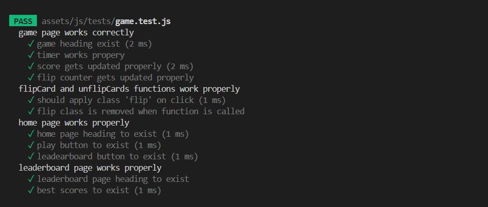

# GWENT MEMORY GAME 

[Link to a live site](https://patrycjablaszkowska.github.io/gwent-memory-game/)

## INTRODUCTION 

Welcome to my second project,part of the Code Institute Full Stack Development Course. The main purpose of this project is to build a fully functioning web application with JavaScript. 

The Gwent Memory Game is a online card game inspired by Witcher's universe.

The user is able to navigate through the website using a fully responsive navigation bar and buttons.
The user can see the leaderboard, including the best scores, as well as save their own after the game is over.
The game is over when the player matches all 8 pairs of cards, or after 60 seconds.

### Thank you for visiting Gwent Memory Game!

## UXD – User Experience Design

A user experience designer, Jesse James Garrett, introduced five UX design elements in his book The Elements of User Experience.
In the book, he explains the steps of user experience projects and what UX designers should consider at each stage.
This is where most of my planning process steps came from.

The 5 planes of UX are as below:

- The Strategy Plane
- The Scope Plane
- The Structure Plane
- The Skeleton Plane
- The Surface Plane

## The Strategy Plane

### Creator Goals :

- As a creator, I want webpage to be user-friendly.
- As a creator, I want webpage to be fully responsive.
- As a creator, I want webpage to be functional.
- As a creator, I want webpage to be easy to navigate.
- As a creator, I want the purpose of my webpage to be clear.
- As a creator, I want users to like the game and be willing to play it again or / and share it with friends.

### User stories :

- As a user, I want the webpage to be easy to navigate.
- As a user, I want the purpose of the website to be explained straight away.
- As a user, I want the rules of the game explained to me before I proceed to play it. 
- As a user, I want the game to allow me to save and see my score.

**User stories are based on online research and my relatives experiance.**

## The Scope Plane

The planning process helped me decide which features could be implemented within a given deadline and which ones needed to be postponed. I decided to implement the ones covering my user stories first and add the remaining features later.

#### Features implemented upon webpage release :

- Home page with an introduction, game features, and game rules.
- Functional navigation bar, allowing users to navigate to different pages.
- Game page, including the actual game.
- Leaderboard page to save and store best scores.
- "Home" button on every page to ensure users can navigate easily.
- Footer with social media links.

#### Fatures planned to implement later :

- Option for a user to create an account so he can keep his best scores and access it on a different browser or device.
- Option for a user to share his score on social media.
- Multiplayer mode, so players can compete with each other online. 

*Above decisions have been made based on below table.*

| Feature       | Feasibility   | Importance    |
| ------------- |:-------------:|:-------------:|
|Navigation     | 5             | 5             |
|Introduction   | 5             | 5             |
|Game Features  | 5             | 5             |
|Instructions   | 5             | 5             |
|Game page      | 5             | 5             |
|Social media   | 5             | 4             |
|Multiplayer mod| 3             | 3             |
|Score share    | 3             | 3             |
|Leadearboard   | 5             | 4             |
|Create account | 3             | 3             |

## The Structure Plane

### Colors :

#FAFAFA :

- Text
- Navigation bar
- Icons (social links)
- Horizontal break lines (hr HTML tags)

#000 :

- Background color

#E2E6EA : 

- Buttons background color

#DAE0E5 :

- Buttons border color

### Fonts :

**As my main font, I used custom "The Witcher Font" to improve the user experience and make him feel more like in the "The Witcher 3" video game.**

*More about this font in credits section*

#### Roboto :

I used "Roboto" Google Font as a callback font in case my custom one wouldn't load. I decided to use it because it's one of the most popular and user-friendly fonts. 

### Images :

Images for this project has been downloaded from:

- [Gwent One](https://gwent.one/)
- [Creative Uncut](https://www.creativeuncut.com/)
- [Wallpaper Cave](https://wallpapercave.com/)

***More information in credits section.***

## The Skeleton Plane

I made some significant changes to my project. I realised that I missed some important features. In my opinion, it was causing a poor user experience, so I decided to implement some changes.

[Home page wireframes](/docs/wireframes/home.pdf)

- I decided to change a original layout for a features section on desktop. Instead of placing all of them in one column I decided to split them and floated them to right and left. It helped me to create a visual impression of "two columns" and improve user experiance.

- I decided to add a button linked to a leaderboard so user can access it before playing a actuall game.

[Game page wireframes](/docs/wireframes/game.pdf)

- I decided to add a button linked to a home page so user can navigate easily.
- I decided to add a button linked to a leaderboard so user can access it while playing a game without a need of finishing it.

[Leaderboard page wireframes](/docs/wireframes/leadearboard.pdf)

- I decided to change a heading from "Leaderboard" to "Best Scores".
- I decided to add a button linked to a home page so user can navigate easily.

#### ADDITIONAL PAGE 

After I finished my planning process, I did some additional research and decided to change "Game Over Modal" to the full HTML Gave Over page. This has been added later in the development process. Therefore, I didn't originally create a wireframe for this page.

## The Surface Plane

### Features present across the project :

### Navigation bar :

- Navabar is present on home page and fully responsive across all resolutions.
- Navbar toggles to a hamburger menu on mobile devices.
- User can navigate to all additional pages easily. 

**Desktop** :

**Mobile**

### Footer :

- Footer is present on the home page and fully responsive across all resolutions.
- Footer contains social media links that are opening in a new tab.

### "Navigation" buttons :

There are different types of buttons present across all pages, so the user can navigate easily.
Buttons provide a better user experience than the navbar when playing an actual game.
All buttons are fully responsive and working with no issues.

**Home button**

- Present on the game page so the user can go back without needing to finish a game.
- Present on the leaderboard page so the user can go back to the home page after checking the best scores.
- Present on the game-over page so the user can go back to the home page without saving a score.

**Leaderboard button**

- Present on the home page so the user can see the leaderboard before playing a game.
- Present on the game-over page so the user can see the leaderboard without saving a score.

**Play button**

- Present on the home page, so the user can start a game from the bottom of the page too. 

**Reset button**

- Present on the game page so the user can reset a game before finishing it.
- Present on the game over screen so the user can play again without saving a score. 

### Introduction section : 

- The introduction section shows the purpose of the website right away, so the user can determine if this game is suitable for him within the first few minutes.

### Game features section :

- The game features section shows what the game has to offer and all the advantages of playing it.

### Instructions section :

- The instructions section instructs the player on how to play the game.

### Game info section :

- The game info section includes a timer, score, and flips counter.

### Game section :

- The game section includes fully functioning game board of 16 cards.
- The player have 60 seconds to match as many pairs of cards as possible.

### Game over screen :

- The game-over screen is presented to the player either after 60 seconds or if the player manages to match 8 pairs of cards before time runs out.
- The game-over screen allows player to save his/hers name to the leaderboard or navigate back.

### Best scores section :

- The best scores section allows the player to see scores he/she saved. 

## Technologies Used 

- [HTML](https://developer.mozilla.org/en-US/docs/Web/HTML)
- [CSS](https://developer.mozilla.org/en-US/docs/Web/CSS)
- [JavaScript](https://developer.mozilla.org/en-US/docs/Learn/JavaScript)
- [Jest](https://jestjs.io/)
- [jQuery](https://jquery.com/)
- [Gitpod](https://www.gitpod.io/)
- [Github](https://github.com/)
- [Git](https://git-scm.com/)
- [Bootstrap 4.6](https://getbootstrap.com/docs/4.6/getting-started/introduction/)
- [FontAwsome](https://fontawesome.com/)
- [Balsamiq](https://balsamiq.com/wireframes/?gad_source=1&gclid=Cj0KCQiAy9msBhD0ARIsANbk0A_UrgDIhg_KSUHNCOUn-D9DiHl_9Z1dwScGRuI4JET1bnKbQkqwSb8aArFqEALw_wcB)
- [Google Fonts](https://fonts.google.com/)
- [QuillBot](https://quillbot.com/)
- [Google Developer Tools](https://developer.chrome.com/docs/devtools/)

## Testing

### User stories :

[User stories testing](/docs/testing/testing.md)

### Automatic Testing(Jest) :

I tested all functions I was able to using Jest. I weren't able to test all of them due to the structure of the code. They would require complicated, deep tests or direct "user" interaction which was extremely difficult to "symulate" in code. However, I addionally testem them in the console and by playing the game myself. I was able to test the most important functions and a game features without which game wouldn't work at all. Tests results below :

**IMPORTANT** :
- For test purposes, I moved the below variables inside the increaseScore() function so the score can be easily updated retrieved from the DOM:

let scoreStr = document.querySelector("#score");
let score = parseInt(scoreStr.innerHTML);

However, I needed to make them global variables again in order for the score to be passed to the local storage and so the GameOver() function could work properly.
### Manual Testing :

- Navigation bar :
    - Navigation bar is fully responsive on large/medium/small resolutions.
    - Navigation bar toggles to a hamburger menu on mobile devices and stays fully responsive.
    - All links to pages are working properly.

- Footer :
    - Footer is fully responsive on large/medium/small resolutions.
    - Social media links are working and opening in a new tab.

- "Navigation" buttons :
    - All buttons across webpage are working properly.
    - Buttons are resposive and have a proper size on smaller devices.

- Grid system(Bootstrap) :
    - Grid system is working as intended successfully changing amount of collumns on smaller devices making website fully responsive. 

- Game info section :
    - The timer starst running only once user clicks on the first card.
    - The flip counter is updated after each pair of cards gets flipped.
    - The score is updated once the player manages to get a matching pair of cards.

- Game board :
    - A card clicked by the user is getting flipped.
    - The timer and a game board are "linked" properly.
    - Once the user flips two cards, the game board is blocked successfully. ***(This prevents the player from flipping more than two cards.)***
    - The flip counter is updated successfully after each pair of cards is flipped.
    - If the match doesn't occur, both cards are getting unflipped successfully.
    - If a match occurs, both cards remain flipped, and the user can click another card. In that case, the score is being updated successfully.
    - Once the time is up or the score is equal to 8, the user is successfully redirected to the game-over screen.
    - The user's score is passed to the local storage successfully.

- Game-over screen :
    - The score on the page is equal to the user's score. Score is being successfully fetched from local storage.
    - "Save button" is successfully enabled once the user enters something in the designated input area.
    - The user is successfully redirected to the leaderboard once the score is saved.

- Leaderboard (best scores) :
    - Saved scores are successfully stored and displayed on the leaderboard.

### Devices used during testing :

- Desktop Computer
- Iphone 13
- Lenovo Tab M10 Plus

### Chrome Dev Tools :

Chrome dev tools was used throughout the development of the project to test responsiveness. 
Responsiveness was tested using Dev Tools and Responsive Viewer browser extension to emulate the following devices :

- Iphone SE
- Iphone XR
- Iphone 12 Pro
- Iphone 14 Pro Max
- Pixel 7
- Pixel 2
- Samsung  Galaxy S9, Note 8, S8
- Samsung Galaxy S8+
- Samsung Galaxy S20 Ultra
- iPad Mini
- iPad Air
- iPad Pro
- Surface Pro 7
- Surface Duo
- Galaxy Fold
- Asus Zenbook Fold
- Samsung Galaxy A51/71
- Nest Hub
- Nest Hub Max
- Nexus 6P
- Kindle Fire HDX 
- LG Optimus L70
- Nokia 8110 4G

### Browser Testing :

During development, webpage was mainly tested on Google Chrome. 
However, during testing process below browsers have been used :

- Google Chrome
- Microsoft Edge
- Mozilla Firefox
- Opera
- Safari

### Validation :

[HTML validator](https://validator.w3.org/)

- 0 errors
- 0 warnings

[CSS validator](https://jigsaw.w3.org/css-validator/)

- 0 errors
- 0 warnings

[Js validator](https://jshint.com/)

**Game.js** :

 - One undefined variable - "module" :
    - module.exports has been used to export js functions in order to test them with Jest. As per [freeCodeCamp](https://www.freecodecamp.org/news/module-exports-how-to-export-in-node-js-and-javascript/) the syntax is valid. Using if (typeof module === 'object') removed the error from the console but not from the JSHint.

**Game-over.js** :

- One unused variable - saveScore()  :
    - Event listener for this function has not been created, however, function has been called in game-over.html on line 25 as per below:

**Leaderboard.js** : 

- 0 warnings
- 0 errors

### Bugs and Fixes :

- The custom font made 0 and 8 look the same when displaying points, flips, and time left:
    - Decided to change a font to Roboto for all numbers to improve user experiance and avoid confusion.

## Deployment 

The master branch of this repository is the most current version and has been used for the deployed version of the site.
The Code Institiue student template was used to create this project.

[Code Institute Template for Gitpod](https://github.com/Code-Institute-Org/gitpod-full-template)

1. Click **Use This Template** button.
2. Give your repository a name, and description.
3. Open [Gitpod EDI](https://www.gitpod.io/) and log into your account.
4. Click **New Workspace** button.
5. Create a workspace from your project repository by creating a clone.

### Creating a clone :

1. From the repository, click **Code**.
2. In the **Clone >> HTTPS** section, copy the clone URL for the repository.
3. Paste a link into the designated area on the Gitpod.

### Forking :

1. From the repository, click **Fork**.
2. Give your repository a name.
3. Click **Create fork**.

## Credits

### Images :

- Creativeuncut
- Gwent.one 
- Wallpapercave

[Front card images](https://www.creativeuncut.com/art_gwent-the-witcher-card-game_a.html)

[Back card image](https://gwent.one/image/assets/cardback/default-monster.png)

[Features section background](https://wallpapercave.com/w/wp1854866)

### Code :

- [Bootstrap version 4.6](https://getbootstrap.com/docs/4.6/getting-started/introduction/) :
    - Used for navigation bar, grid system, buttons.

- [Stackoverflow](https://stackoverflow.com/questions/56283681/js-memory-card-game-how-to-prevent-user-flipping-more-then-2-cards-at-the-same)
    - Inspiration on how to disable the game board after two cards get flipped.

- [Font bolt](https://www.fontbolt.com/font/the-witcher-font/?fbclid=IwAR3p6DrAHJU7INE4L-FRND1MCXrjkKPkGXOEnm39aJ24m8h8juzJ6sH1zHQ_aem_AbCVXPy7sqCR_dROUKkk3YeNAtkgsxyMaFCHrtr9DdZZ692yBlyxFewUfKSeRKxtM4g6bnP5eDzEgQk07y_Z9-d5)
    - Custom witcher font.

- [Youtube - code along tutorial](https://www.youtube.com/watch?v=jfOv18lCMmw)
    - Code along tutorial on how to use local storage.

## Thank you for reading this documentation! 
